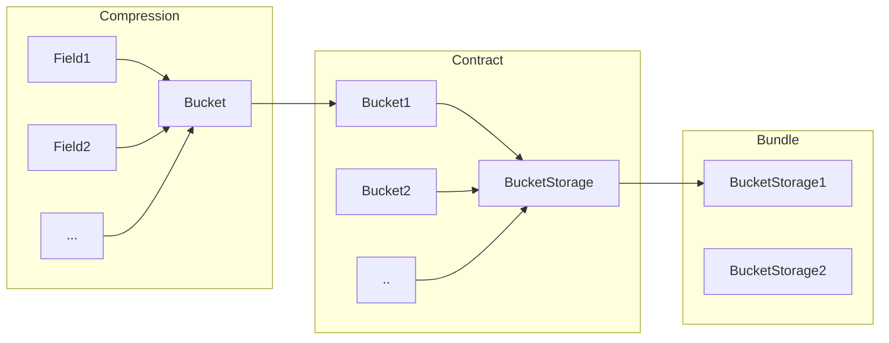

<p align="center">
  
  <h1 align="center">Solidify</h3>
</p>

---

[](/LICENSE)

`solidify` is a golang + solidity library aimed to make storing arbitrary data on EVM blockchains as easy and efficient as possible.

> But remember: *With great power comes great responsibility*.  
This library is not intended to turn the Ethereum blockchain into a general data storage.
Instead, it strives to improve the situation by making it as efficient as possible and empower projects where on-chain data is mission critical. 


## Getting started

### Dependencies

This project uses golang generics.
Make sure you have `go > 1.18` installed on your machine.
See [here](https://go.dev/doc/install) for more info.

For smart-contract testing we use [Forge](https://book.getfoundry.sh/).
Install it following the instructions [here](https://book.getfoundry.sh/getting-started/installation) or simply run

```bash
curl -L https://foundry.paradigm.xyz | bash
foundryup
```

### Running tests

To see if your installation was successful run the project's tests via

```bash
go generate ./...
go test ./...
forge test
```

## Documentation

The library consists of a golang (`./go`) and a solidity (`./contracts`) part.
The former is intended to generate contracts containing data which can then be accessed on-chain using the latter.

### General concept

There are three central concepts that are used frequently throughout this library to build up a storage pattern: `Field`, `Bucket` and `BucketStorage`.

- `Field` is any generic object that can be serialised into a binary blob. For example, this could be a subimage frame that can be serialised into a raw (A)RGB stream with frame location metadata.  
- `Bucket` is used to assemble multiple `Field`s and compress them. `Bucket`s futher add access information to the  assembled blob data to facilitate `Field` access. For example, this could consist of adding a index header to the joint blob to mark at which offset each field starts.  
- `BucketStorage` is a list of `Bucket`s that will be turned into a smart-contract. 




### Bucket flavours

The library comes with two already implemented types of buckets under `go/utils`: `IndexedBucket` and `LabelledBucket`.

`IndexedBucket` prepends a field offset header to the concatenated field blobs that stores the index at which each field starts.
Fields in such buckets can be accessed using the `contracts/IndexedBucketLib.sol` library.

`LabelledBucket` prepends a field label to each fixed-sized field data blob.
The field data can then be accessed using a binary search over sorted labels implemented in the `contracts/LabelledBucketLib.sol` library.

The contract writing routines in `go/storage` are agnostic of the exact Bucket implementation.
So the user is free to implement their own Buckets, i.e. index schemes as needed.

### Examples

To get more familiar with the library we encourage the reader to take a look at the tests under `/test/**/testgen` and how we applied it to put [Moonbirds](https://moonbirds.xyz) in-chain under `examples/moonbirds`. 