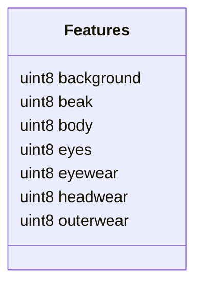
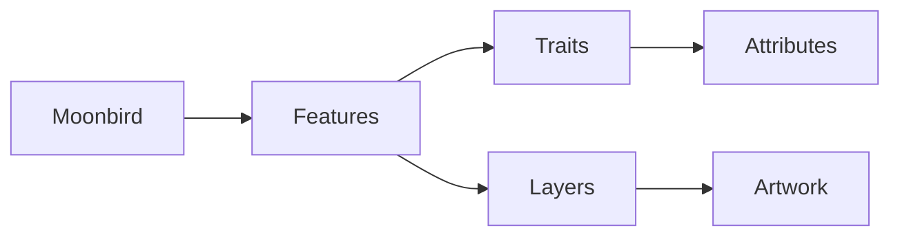
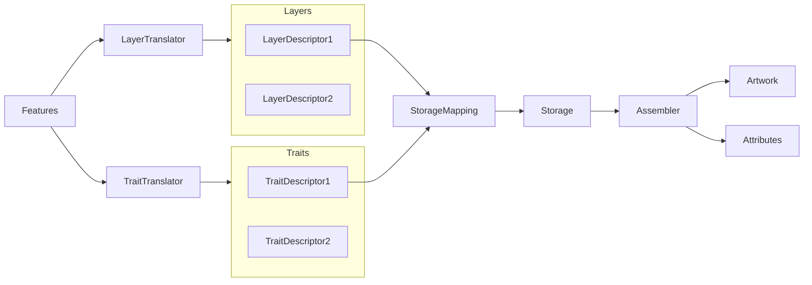
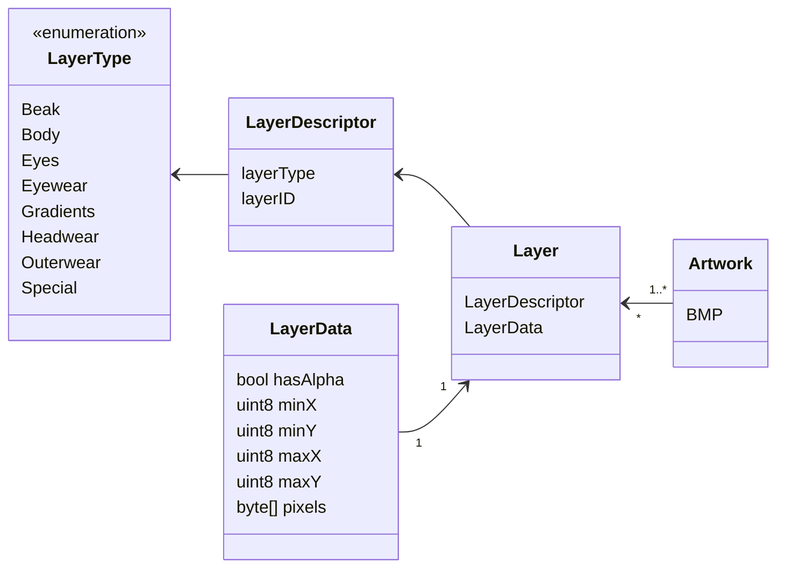
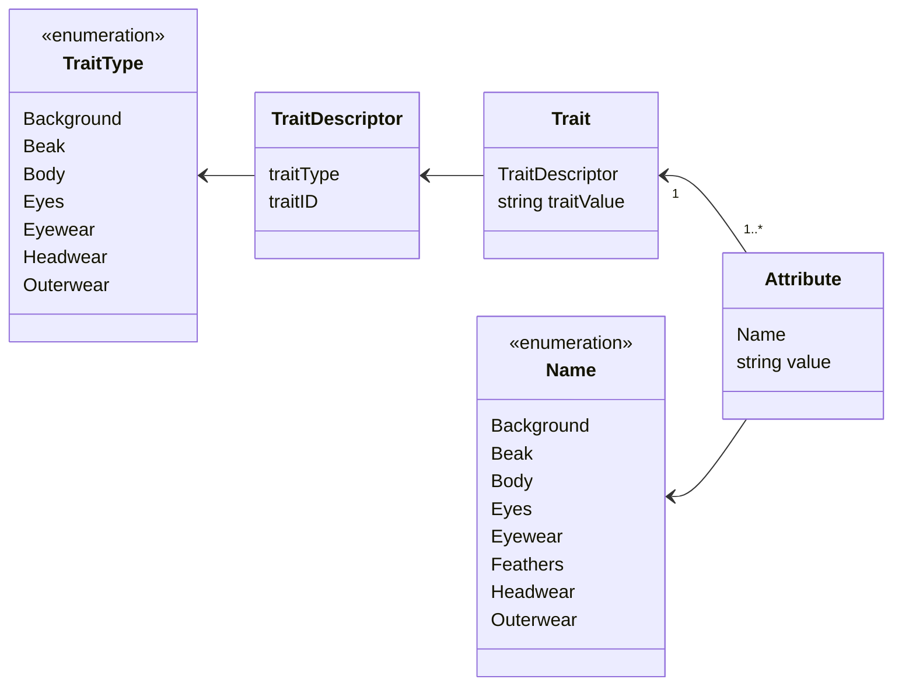

# Moonbirds in-chain

Here we showcases `solidify` by applying it to the assets of Moonbirds, generating the storage and utility contracts we used for our in-chain renderer.

This repo only contains the code that is most relevant for the on-chain data consumption.
To see all contracts we refer the reader to 


## Quick start

Please follow the [solidify installation instructions](https://github.com/proofxyz/solidify#getting-started) first.

To run the `solidify` storage contracts generation and the included tests execute

```
go generate ./...
mkdir bin
go build -o ./bin ./testing/...
forge test
```

The intermediate go build step compiles helpers programs that will be called by forge during testing.

To validate the in-chain renderer against reference data for the entire Moonbirds collection run

```
FOUNDRY_PROFILE=full forge test
```

If you are missing one of the git submodules, run
```
git submodule --init --recursive
```

## Data Structure

### Features



Each Moonbird (i.e. it's artwork and metadata attributes) is fully described by its `Features` - a set of `uint8` indices describing expressions of different feature types (see also [Features.sol](./src/gen/Features.sol)).
For example, Moonbird #0 has the features `[4,16,98,11,0,0,6]`.



For data management, we first devise two intermediate representations that are closely related to the image and attribute data in its raw form: Layers and Traits (see also the following sections for more details).
Both contain a descriptor (type + index pair) that uniquely identifies a blob of data, that is an image or string stored as a `Field` in a `Bucket`.



The assembly of the final Moonbird happens in multiple steps:
- First a given set of features is translated into a set of Layers and Traits. This step is straightforward for Moonbirds was therefore implemented manually (see also [Assembler.sol](./src/Assembler.sol)).
- Next the 

### Layers

Layers correspond to the physical files that need to be stored/loaded to create the artwork.
They are grouped by their canonical layer type as listed below (see also [layers.go](./solidifier/layers.go) and [LayerStorageMapping](./src/gen/LayerStorageMapping.sol)).
For example, the layer with descriptor `(Eyewear, 0)` corresponds to the image file `assets/moonbirds-assets/traits/Eyewear/3D Glasses.png`

Note that there is no type for backgrounds, since they can either be solid colours (that do not need to be stored as full image), a `Gradient` or the PROOF background in the `Special` group.




### Traits

Traits correspond to string that need to be stored/loaded to create the metadata attributes.
Their types correspond to the same fields present in the `Features` struct for easy access (see also [traits.go](./solidifier/traits.go) and [TraitStorageMapping](./src/gen/TraitStorageMapping.sol)).
For example, the trait with descriptor `(Body, 0)` corresponds to `Brave-Black`.  

Note that there is an additional `Feathers` type in the metadata, it will be be created together with the `Body` attribute from the `Body` trait by splitting its content at the `-` character (see also [Assembler.sol#L101-L126](./src/Assembler.sol#L101-L126)).
The attentive reader might ask themselves if this wont lead to redundant data and they are absolutely right.
However, this will be rendered insignificant after deflate-compressing the blob that goes into storage. 





